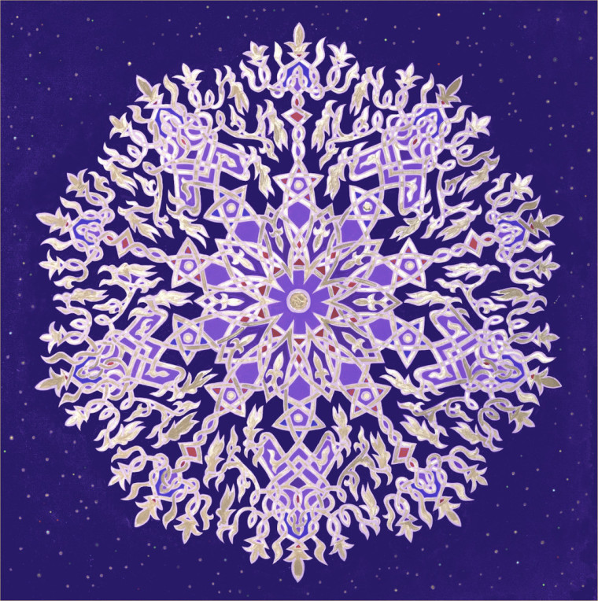
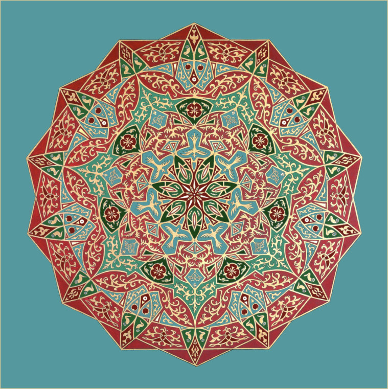
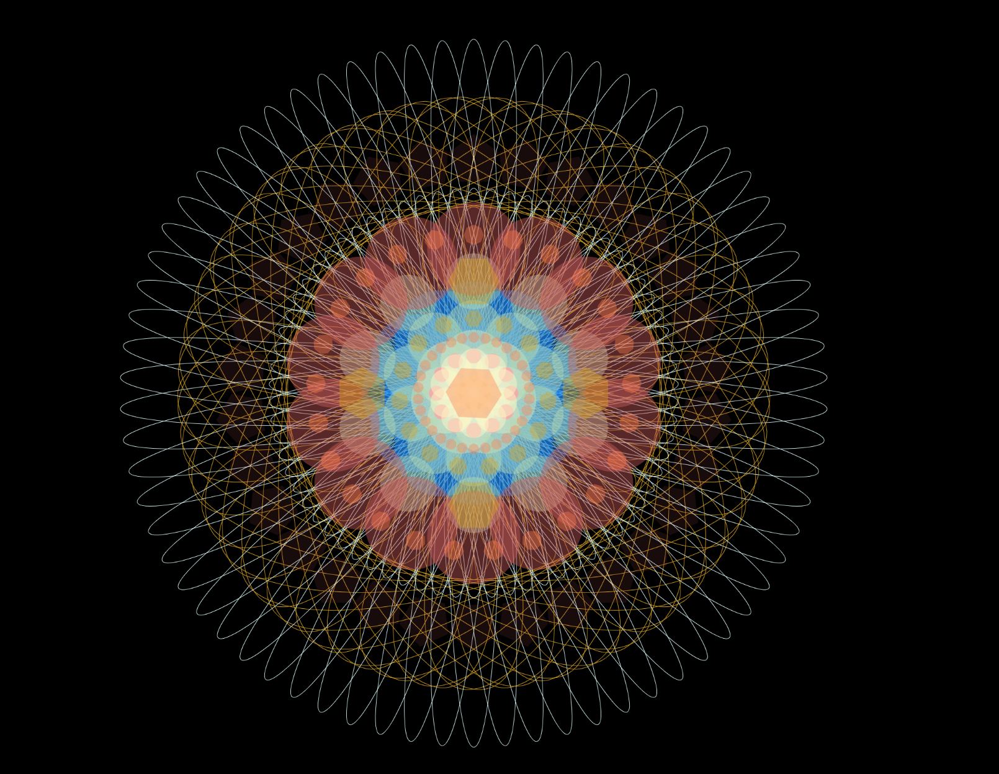
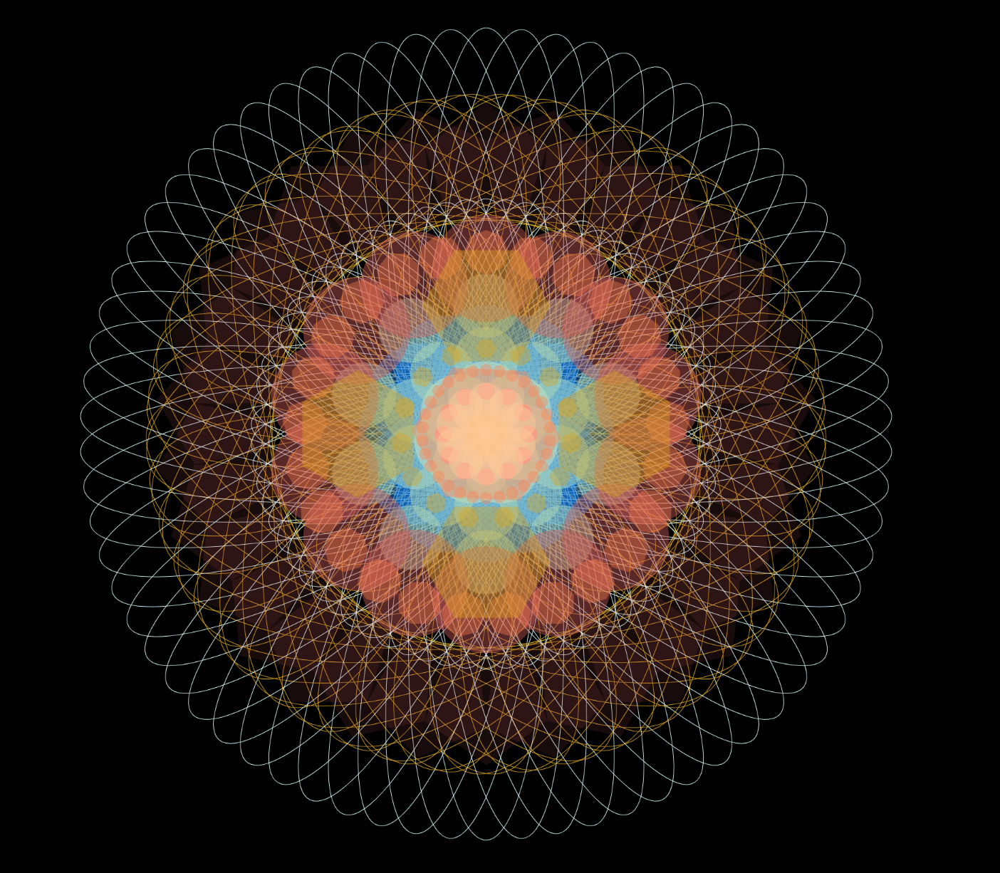

## __Part 1: Imaging Technique Inspiration__

#### My inspiration comes from mandala paintings by Stephen Meakin. I’m intrigued by its various colors and radial structure which is similar in composition to the artwork we’ve chosen (Wheels of fortune by Pacita Abad). My idea is that I could add more rich colors and patterns like the elements of these mandala paintings into the original circles. I can also have them in constant motion with time-based method, such as expanding outward, contracting inward or spinning to make the artwork more eye-catching.

[Source: Mandala painting by Stephen Meakin](https://www.themandalacompany.com/)

## __Part 2: Coding Technique Exploration__

#### This reference code shows a radial structured circle, with different shapes changing their colors and lines changing their forms. They are also constantly expanding and retracting over time. This can help me to achieve my idea which is to add more colors and patterns to the circles in the artwork. At the same time, changing colors and shapes over time is in line with the time-based method that I’ve chosen. By changing colors, shapes and frame rate, I can adjust the effect by myself to match the original artwork better.

[Code source](https://openprocessing.org/sketch/1803254)